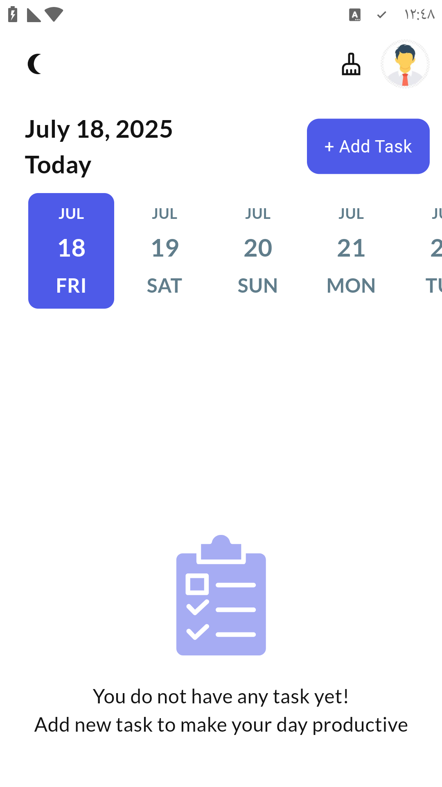
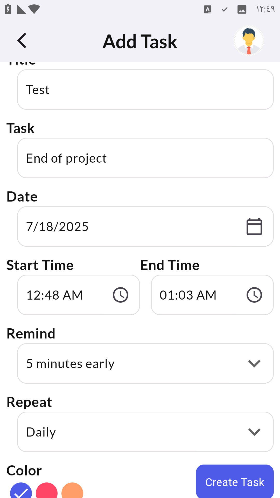
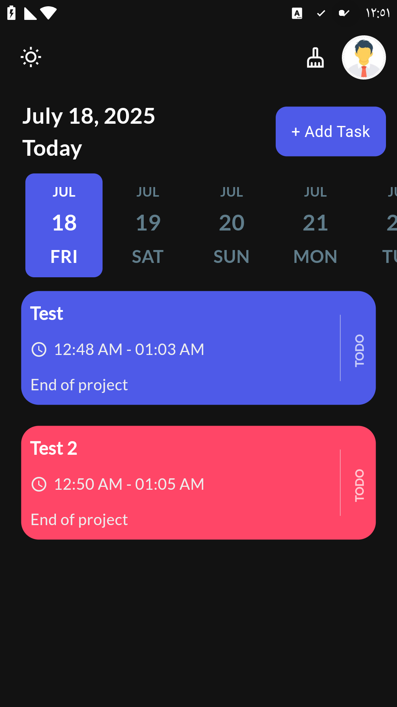
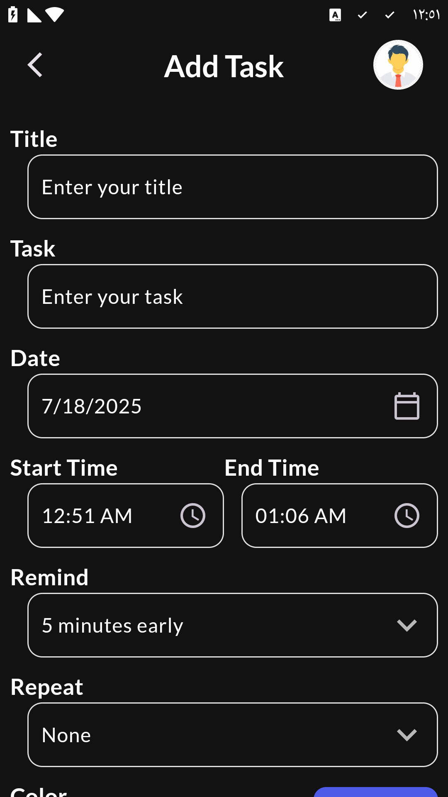

# 📝 To-Do Pro

A powerful and beautiful to-do list app built with Flutter.  
Manage your daily tasks efficiently, receive notifications, and enjoy a clean dark/light theme interface.

---

## 📸 Screenshots

### 🌞 Light Theme




### 🌙 Dark Theme




---

## 🚀 Features

- ✅ Add, edit, and delete tasks
- ⏰ Schedule local notifications
- 📅 Filter tasks by date
- 🌗 Light and dark mode support
- 💎 Beautiful UI with smooth animations
- 🗄️ Uses SQLite for local database storage
- 🕐 Time and date pickers
- 📱 Responsive design

---

## 🛠️ Built With

- [Flutter](https://flutter.dev/)
- [GetX](https://pub.dev/packages/get) – for state management and routing
- [flutter_local_notifications](https://pub.dev/packages/flutter_local_notifications) – for local notifications
- [sqflite](https://pub.dev/packages/sqflite) – for local database
- [intl](https://pub.dev/packages/intl) – for formatting dates and times
- [flutter_native_timezone_2025](https://pub.dev/packages/flutter_native_timezone_2025) – to get the local timezone of the device

---

## 📂 Project Structure

```bash
lib/
│
├── controllers/          # GetX controllers (e.g., TaskController)
├── db/                   # SQLite database operations (e.g., DBHelper)
├── models/               # Task model
├── services/             # Notification + Theme services
├── ui/
│   ├── pages/            # Screens: HomePage, AddTaskPage, etc.
│   ├── widgets/          # Reusable UI widgets
│   ├── size_config/      # Screen size configurations
│   └── theme/            # Theme data and styling
└── main.dart             # App entry point
